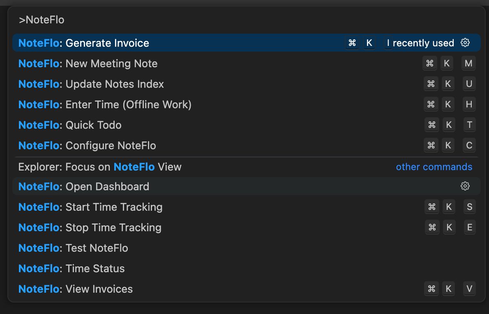
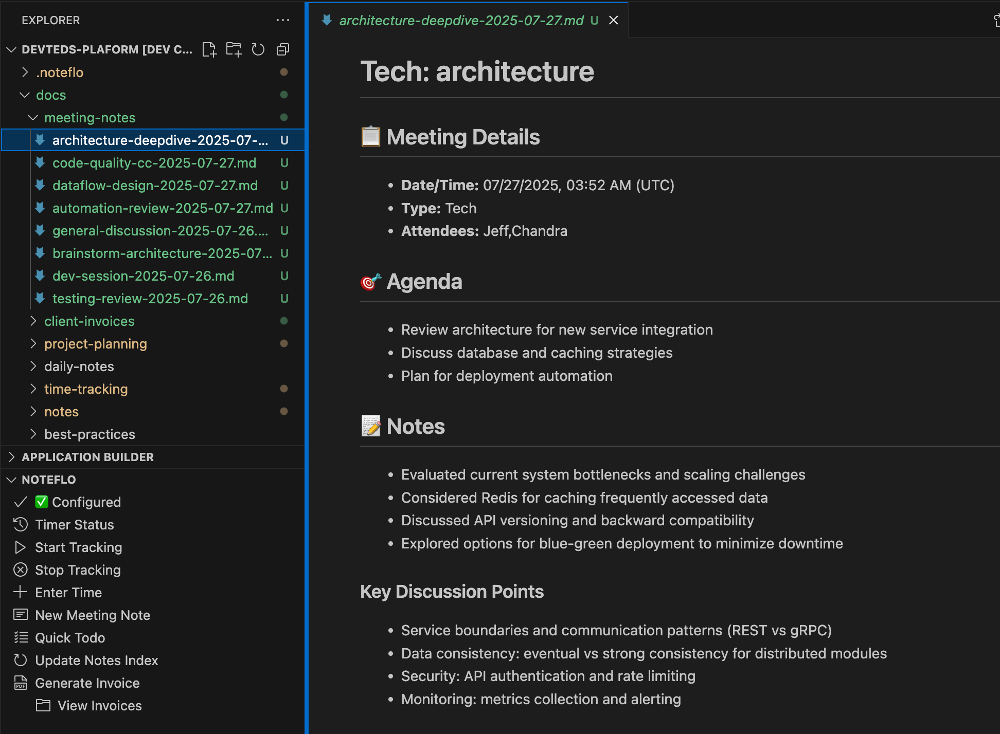
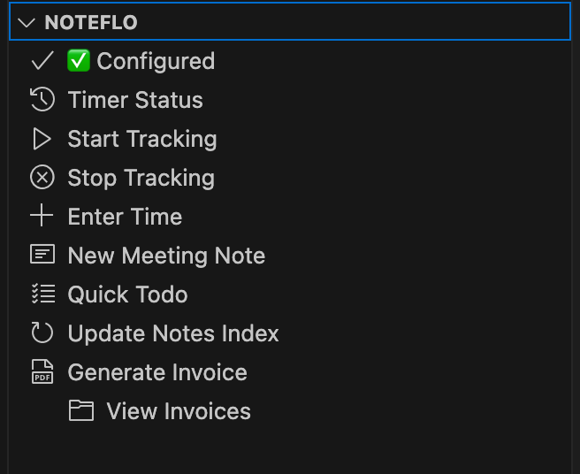
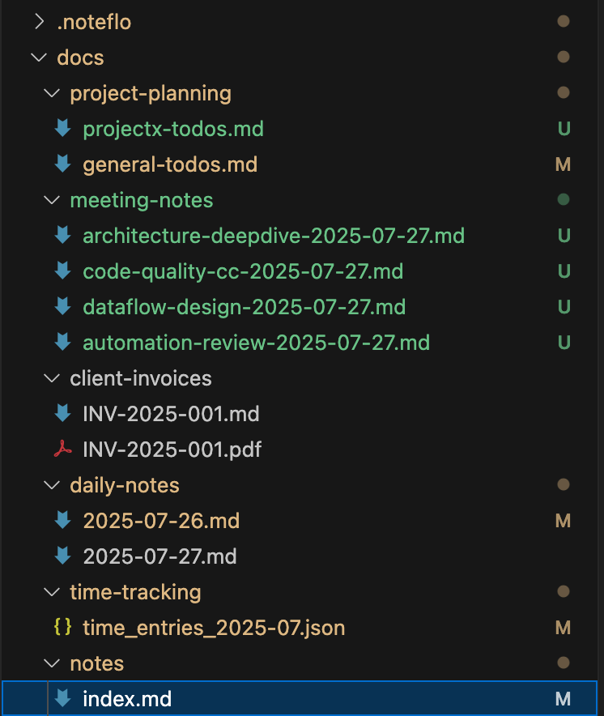
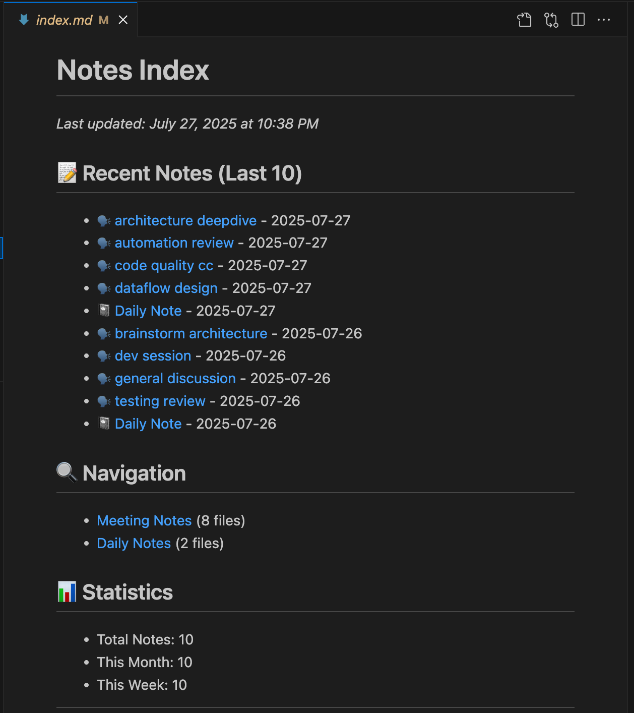
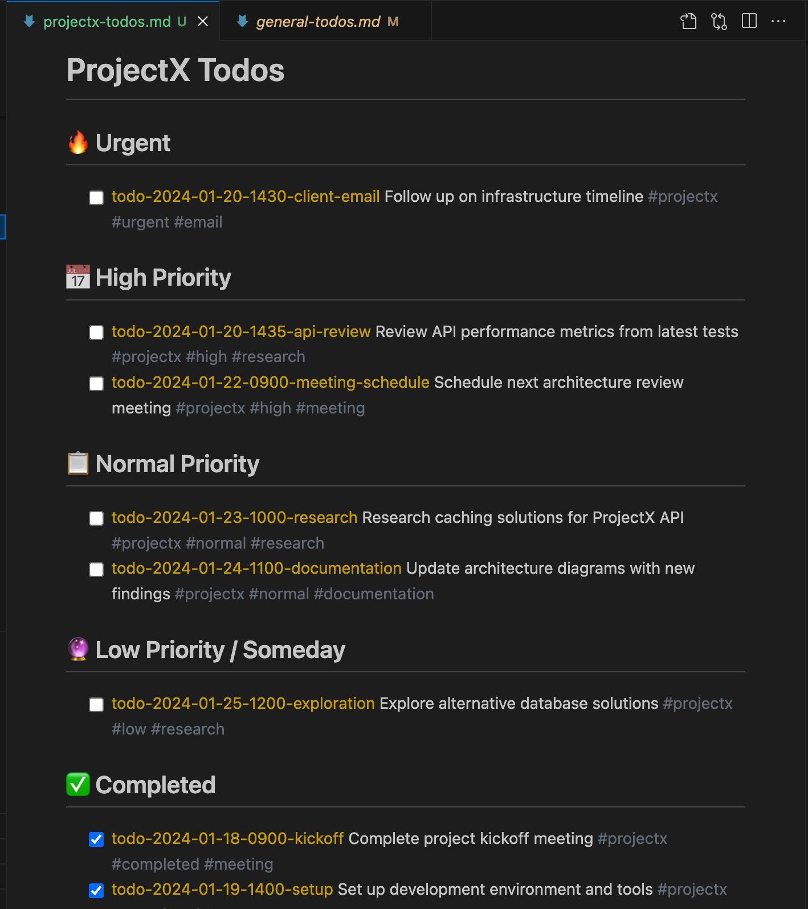

# NoteFlo - Professional Workflow Extension for VS Code

**Professional workflow solution: time tracking, notes, todos, and invoicing for consultants and freelancers**

[](https://code.visualstudio.com/)
[](https://www.typescriptlang.org/)
[](https://nodejs.org/)
[](LICENSE)

[](https://marketplace.visualstudio.com/items?itemName=devteds.noteflo)
[](https://marketplace.visualstudio.com/items?itemName=devteds.noteflo)
[](https://marketplace.visualstudio.com/items?itemName=devteds.noteflo)

*Built by [Chandra Shettigar](https://github.com/shettigarc)*

## 🎯 Overview

NoteFlo is a comprehensive VS Code extension designed for consultants, freelancers, and professionals who need to seamlessly manage their workflow within their development environment. It combines time tracking, note-taking, todo management, and professional invoicing into a unified, efficient system.

Perfect for developers, consultants, and freelancers who want to:


## 🖼️ Screenshots

<div align="center" style="display: flex; flex-wrap: wrap; gap: 12px; justify-content: center;">
  
  
  
  
  
  
</div>

<p align="center"><i>NoteFlo in action: command palette, meeting notes, sidebar, explorer, notes dashboard, and todos.</i></p>


## 🌟 Key Features

### ⏱️ **Smart Time Tracking**
- **One-click start/stop** time tracking with descriptions
- **Manual time entry** for offline work, meetings, and travel
- **Real-time status bar** showing active timer and elapsed time
- **Monthly file rotation** for organized time entry storage
- **Timezone-aware** timestamps (configurable CST, EST, PST, etc.)

### 📝 **Enhanced Note Management**
- **Meeting notes** with structured templates, attendee tracking, and time integration
- **Daily journals** for reflection and planning with focus areas
- **General notes** with categorization and metadata
- **Priority-based todos** with visual indicators (🔴 Urgent, 🟠 High, 🟡 Normal, 🟢 Low)
- **Smart categorization**: General vs Project todos with automatic workspace detection
- **Auto-generated notes index** organized by type and recency
- **Dynamic dashboard** with analytics and quick access to recent items
- **Foam-compatible** wiki-linking and graph visualization
- **Git-friendly** filename conventions optimized for both readability and automation

### 💰 **Professional Invoicing**
- **Dual-format generation**: Markdown + PDF invoices
- **Sequential invoice numbering** (INV-2025-001, INV-2025-002...)
- **Comprehensive invoice details**: business info, client details, line items, tax calculations
- **Multi-page PDF support** with automatic page breaks
- **Configurable currency** and tax rates (default INR, supports any currency)
- **Professional PDF layout** with proper spacing and formatting

### 🎯 **Integrated Workflow**
- **Sidebar integration** for quick access to all features
- **Command palette** commands for keyboard-driven workflow
- **Smart time tracking prompts** when creating meeting notes
- **Dynamic dashboard** with real-time analytics and quick actions
- **Auto-updating indexes** for seamless organization
- **Cross-platform compatibility** with consistent behavior

## 🚀 Installation

### From VS Code Marketplace (Recommended)
1. **Open VS Code**
2. **Go to Extensions** (`Ctrl+Shift+X` / `Cmd+Shift+X`)
3. **Search for "NoteFlo"** by Devteds
4. **Click Install**
5. **Open a workspace folder** (required for NoteFlo functionality)

**Or install via Command Palette:**
1. Open Command Palette (`Ctrl+Shift+P` / `Cmd+Shift+P`)
2. Type: `ext install devteds.noteflo`
3. Press Enter

**Or install via terminal:**
```bash
code --install-extension devteds.noteflo
```

[**→ Install from VS Code Marketplace**](https://marketplace.visualstudio.com/items?itemName=devteds.noteflo)

### From VSIX Package (Development)
1. Download the latest `noteflo-1.x.y.vsix` file
2. Open VS Code  
3. Run: `code --install-extension noteflo-1.x.y.vsix`
4. Reload VS Code window
5. Open a workspace folder (required for NoteFlo functionality)

### Initial Setup

**Configuration is completely optional!** NoteFlo works out-of-the-box for note-taking and todos. Only configure if you need time tracking and invoicing features.

1. Open Command Palette (`Ctrl+Shift+P` / `Cmd+Shift+P`)
2. Run **"NoteFlo: Configure NoteFlo"** (only if you need billing/invoicing)
3. Follow the interactive setup wizard:
   - Business information (name, address, email) - **Required for invoicing**
   - Client details - **Required for invoicing**
   - Billing settings (hourly rate, currency, tax rate) - **Required for invoicing**
   - Timezone configuration
   - Payment instructions

**Note**: Business and billing configuration is only necessary if you're doing consulting work and need invoicing. For notes, todos, and basic time tracking, no configuration is required.

### Configuration Files
NoteFlo uses two separate configuration systems:


**1. Note Organization (`.noteflo/note-config.json`)** - For directories (optional)
```json
{
  "directories": {
    "meeting_notes": "docs/meeting-notes",
    "daily_notes": "docs/daily-notes", 
    "general_notes": "docs/notes",
    "dashboard": "docs/dashboard"
  },
  "files": {
    "main_dashboard": "docs/index.md"
  },
  "settings": {
    "auto_refresh_dashboard": true,
    "default_note_template": "standard",
    "timezone": "America/Chicago"
  }
}
```

**2. Business Configuration (`.noteflo/config.json`)** - For invoicing
```json
{
  "business": {
    "name": "Your Business Name",
    "address": "Your Address",
    "email": "your@email.com",
    "phone": "123-456-7890",
    "website": "yourwebsite.com"
  },
  "client": {
    "name": "Client Name",
    "contact": "Client Contact Person",
    "address": "Client Address",
    "email": "client@email.com"
  },
  "billing": {
    "hourlyRate": 8500,
    "currency": "INR",
    "taxRate": 18,
    "paymentInstructions": "Payment due within 30 days...",
    "invoiceNotes": "Thank you for your business!"
  },
  "preferences": {
    "timezone": "America/Chicago"
  }
}
```

**Configuration is optional:**
- **No config needed**: Notes, todos, and basic functionality work immediately
- **Business config only**: Required for time tracking invoices and professional billing
- **Directory config only**: If you want to customize where notes are stored (uses sensible defaults otherwise)

## 📖 Quick Start Guide

### ⏱️ **Time Tracking**
```
Cmd+K S  - Start time tracking
Cmd+K E  - Stop time tracking
Cmd+K H  - Enter manual time entry
```

1. **Start Tracking**: Use `Cmd+K S` or "NoteFlo: Start Time Tracking"
2. **Enter Description**: Describe what you're working on
3. **Check Status**: Status bar shows active timer and elapsed time
4. **Stop Tracking**: Use `Cmd+K E` or "NoteFlo: Stop Time Tracking"

### 📝 **Note Creation**
```
Cmd+K M  - New meeting note
Cmd+K D  - Create daily journal
Cmd+K N  - Create new note  
Cmd+K T  - Quick todo
Cmd+K U  - Update notes index
Cmd+K R  - Refresh dashboard
```

**Meeting Notes:**
1. Use `Cmd+K M` for structured meeting notes
2. Enter meeting type, description, and attendees
3. Get rich templates with agenda, notes, decisions, and action items
4. Automatic time tracking integration

**Daily Journals:**
1. Use `Cmd+K D` for daily reflection and planning
2. Automatic date-based naming
3. Structured templates with focus areas, accomplishments, and reflections
4. Opens existing journal if already created for the day

**General Notes:**
1. Use `Cmd+K N` for any type of note
2. Choose from categories: Development, Research, Ideas, Documentation, etc.
3. Rich metadata and linking support

**Priority-Based Todos:**
1. Use `Cmd+K T` for quick todo creation
2. **Categories**: 
   - **General**: Personal tasks and reminders → `general-todos.md`
   - **Project**: Current workspace tasks → `project-todos.md`
3. **Priority Levels**:
   - 🔴 **Urgent**: Needs immediate attention
   - 🟠 **High**: Important and time-sensitive  
   - 🟡 **Normal**: Regular priority
   - 🟢 **Low**: Can be done when time permits
4. Automatic organization by priority within each file

### 💰 **Invoice Generation**
```
Cmd+K I  - Generate invoice
Cmd+K V  - View invoices
```

1. **Generate Invoice**: Use `Cmd+K I` and select date range
2. **Choose Format**: Markdown and/or PDF generation
3. **Professional Output**: Sequential numbering and comprehensive details

## 🗂️ **File Organization**

NoteFlo creates a clean, Git-friendly file structure:

```
your-project/
├── .noteflo/
│   ├── config.json              # Your configuration (git-ignored)
│   └── config.template.json     # Template file (git-tracked)
└── docs/
    ├── time-tracking/
    │   ├── time_entries_2025-01.json  # Monthly time entries
    │   └── active_session.json        # Current session (git-ignored)
    ├── index.md                     # Dynamic dashboard (auto-generated)
    ├── meeting-notes/               # Meeting notes (git-tracked)
    │   └── client-discussion-2025-07-28.md
    ├── daily-notes/                 # Daily journals (git-tracked)
    │   └── 2025-07-28.md
    ├── notes/                       # General notes (git-tracked)
    │   ├── index.md                 # Auto-generated index
    │   └── project-idea-2025-07-28.md
    ├── project-planning/            # Todo management (git-tracked)
    │   ├── general-todos.md         # Personal todos
    │   └── project-todos.md         # Workspace-specific todos
    ├── client-invoices/             # Generated invoices (git-tracked)
    └── dashboard/                   # Dashboard components (auto-generated)
```

## ⌨️ **Keyboard Shortcuts**

| Shortcut  | Command              | Description                        |
| --------- | -------------------- | ---------------------------------- |
| `Cmd+K M` | New Meeting Note     | Create structured meeting note     |
| `Cmd+K D` | Create Daily Journal | Create or open today's journal     |
| `Cmd+K N` | Create New Note      | Create categorized general note    |
| `Cmd+K T` | Quick Todo           | Add prioritized todo item          |
| `Cmd+K S` | Start Time Tracking  | Begin tracking with description    |
| `Cmd+K E` | Stop Time Tracking   | End current tracking session       |
| `Cmd+K H` | Enter Time           | Manual time entry for offline work |
| `Cmd+K I` | Generate Invoice     | Create professional invoice        |
| `Cmd+K V` | View Invoices        | Browse invoice history             |
| `Cmd+K C` | Configure NoteFlo    | Access setup wizard                |
| `Cmd+K U` | Update Notes Index   | Refresh notes organization         |
| `Cmd+K R` | Refresh Dashboard    | Update dynamic dashboard           |

## 📋 **Todo Management System**

NoteFlo includes a sophisticated priority-based todo system designed for professional workflows:

### **Categories**
- **General Todos** (`general-todos.md`): Personal tasks, reminders, and non-project work
- **Project Todos** (`project-todos.md`): Tasks specific to your current workspace

### **Priority Levels**
Each todo is assigned a visual priority level:

- 🔴 **Urgent**: Critical issues requiring immediate attention
- 🟠 **High**: Important tasks that are time-sensitive  
- 🟡 **Normal**: Standard priority items for regular workflow
- 🟢 **Low**: Tasks that can be completed when time permits

### **File Structure**
```markdown
# Project Todo List

## Active Tasks

### Urgent Priority
- [ ] **[Urgent]** 🔴 Fix critical production bug *(Added: July 28, 2025 at 10:30 AM)*

### High Priority  
- [ ] **[High]** 🟠 Complete client review by EOD *(Added: July 28, 2025 at 9:15 AM)*

### Normal Priority
- [ ] **[Normal]** 🟡 Update project documentation *(Added: July 28, 2025 at 8:45 AM)*

### Low Priority
- [ ] **[Low]** 🟢 Optimize build scripts *(Added: July 28, 2025 at 8:00 AM)*

## Completed Tasks
- [x] **[High]** 🟠 Deploy hotfix to staging *(Completed: July 27, 2025)*

---
*Priority levels: 🔴 Urgent | 🟠 High | 🟡 Normal | 🟢 Low*
```

### **Smart Organization**
- Todos are automatically sorted by priority within each category
- Timestamps include timezone-aware creation dates
- Completed tasks can be moved to the "Completed Tasks" section
- Dashboard integration shows todo counts and recent additions

## ⚙️ **Configuration System**

NoteFlo has **two optional configuration systems** depending on your needs:

### **🎯 Quick Start (No Configuration)**
- **Notes, todos, journals**: Work immediately without any setup
- **Basic time tracking**: Start/stop tracking works out-of-the-box
- **Default structure**: Uses sensible defaults for file organization

### **💼 Business Configuration (For Consultants/Freelancers)**

**When you need it**: Time tracking with invoicing, professional billing
**Setup**: Run `NoteFlo: Configure NoteFlo`
**File**: `.noteflo/config.json` (git-ignored)

```json
{
  "business": {
    "name": "Your Consulting Business",
    "address": "123 Business St, City, State 12345",
    "email": "your@business.com",
    "phone": "555-123-4567",
    "website": "www.yourbusiness.com"
  },
  "client": {
    "name": "Client Company Name",
    "contact": "Client Contact Person",
    "address": "Client Address",
    "email": "client@company.com"
  },
  "billing": {
    "hourlyRate": 150,
    "currency": "USD",
    "taxRate": 0,
    "paymentInstructions": "Payment due within 30 days. Wire transfer details included.",
    "invoiceNotes": "Thank you for your business!"
  },
  "preferences": {
    "timezone": "America/New_York"
  }
}
```

### **📁 Directory Configuration (Optional Customization)**

**When you need it**: Custom file organization, team consistency
**Setup**: Manual creation or future config command
**File**: `.noteflo/note-config.json` (optional)

```json
{
  "directories": {
    "meeting_notes": "meetings",
    "daily_notes": "journals",
    "general_notes": "notes",
    "dashboard": "dashboard"
  },
  "files": {
    "main_dashboard": "overview.md"
  },
  "settings": {
    "auto_refresh_dashboard": true,
    "default_note_template": "detailed",
    "timezone": "America/Chicago"
  }
}
```

### **Configuration Usage Patterns**

**📝 Notes & Todos Only**
- No configuration needed
- Uses default directory structure
- All note features work immediately

**⏱️ Time Tracking Only** 
- No configuration needed for basic tracking
- Manual time entries and status work
- No invoicing capabilities

**💰 Professional Consulting**
- Business configuration required
- Enables invoice generation
- Professional PDF output with your branding
- Client billing and time tracking integration

### **Configuration Commands**
- **Create Business Config**: `NoteFlo: Configure NoteFlo` - Sets up invoicing
- **Edit Configuration**: `NoteFlo: Edit Configuration` - Opens config file (if exists)
- **Test Configuration**: `NoteFlo: Test Configuration` - Validates current settings

## 🌐 **Timezone Support**

NoteFlo supports configurable timezones for global teams:

- **Configurable during setup**: America/Chicago, America/New_York, Europe/London, etc.
- **All timestamps use your business timezone**
- **Timezone validation** with helpful error messages
- **Multiple date formats** for different contexts

## 📊 **Dynamic Dashboard**

The NoteFlo dashboard provides a real-time overview of your workspace activity:

### **Features**
- **Recent Activity**: Latest meeting notes, journal entries, and general notes
- **Todo Analytics**: Count by priority level and category
- **Time Tracking Summary**: Current session status and recent entries
- **Quick Actions**: Fast access to common commands
- **File Statistics**: Overview of workspace documentation

### **Auto-Updates**
- Refreshes automatically when you create new content
- Smart caching prevents unnecessary regeneration
- Manual refresh available via `Cmd+K R`

### **Dashboard Structure**
```markdown
# NoteFlo Dashboard - Project Name

*Last updated: July 28, 2025 at 2:30 PM (America/Chicago)*

## 📊 Quick Stats
- **Active Todos**: 12 (🔴 2 urgent, 🟠 4 high, 🟡 5 normal, 🟢 1 low)
- **This Week**: 3 meetings, 5 journal entries, 8 notes
- **Time Tracking**: Currently active (2h 15m elapsed)

## 🎯 Quick Actions
- [Create Meeting Note](command:noteflo.newMeetingNote)
- [Quick Todo](command:noteflo.quickTodo)  
- [Start Time Tracking](command:noteflo.startTimeTracking)
- [Generate Invoice](command:noteflo.generateInvoice)

## 📝 Recent Activity

### Meeting Notes (Last 5)
- [Client Review - July 28](docs/meeting-notes/client-review-2025-07-28.md)
- [Sprint Planning - July 27](docs/meeting-notes/sprint-planning-2025-07-27.md)

### Daily Journals (Last 5)  
- [July 28, 2025](docs/daily-notes/2025-07-28.md)
- [July 27, 2025](docs/daily-notes/2025-07-27.md)

### General Notes (Last 5)
- [API Design Ideas - July 28](docs/notes/api-design-ideas-2025-07-28.md)

---
*Dashboard auto-updates when you create new content*
```

## 💼 **Perfect For**

- **Consultants**: Track client work and generate professional invoices
- **Freelancers**: Manage multiple projects with organized time tracking
- **Developers**: Document meetings and track feature development time
- **Project Managers**: Maintain organized notes and todo lists
- **Remote Workers**: Keep structured records of daily activities

## 🛠️ **System Requirements**

- **VS Code**: 1.60+ 
- **Node.js**: 20+ (for development)
- **Operating System**: Windows, macOS, Linux
- **Workspace**: Requires an open folder/workspace for functionality

## 📋 **Command Reference**

### **Configuration**
- `NoteFlo: Configure NoteFlo` - Interactive setup wizard
- `NoteFlo: Edit Configuration` - Open config file for editing
- `NoteFlo: Test Configuration` - Validate current configuration

### **Time Tracking**
- `NoteFlo: Start Time Tracking` - Begin tracking with description
- `NoteFlo: Stop Time Tracking` - End current session
- `NoteFlo: Time Status` - Show current tracking status
- `NoteFlo: Enter Time` - Manual time entry for offline work

### **Note Management**
- `NoteFlo: New Meeting Note` - Create structured meeting note with templates
- `NoteFlo: Create Daily Journal` - Create or open today's journal entry
- `NoteFlo: Create New Note` - Create categorized general note
- `NoteFlo: Quick Todo` - Add priority-based todo (General/Project categories)
- `NoteFlo: Open Dashboard` - Access dynamic dashboard
- `NoteFlo: Update Notes Index` - Refresh notes organization
- `NoteFlo: Refresh Dashboard` - Update dashboard analytics

### **Invoicing**
- `NoteFlo: Generate Invoice` - Create professional invoices
- `NoteFlo: View Invoices` - Browse invoice history

## 🔧 **Troubleshooting**

### **Common Issues**

**Commands not found**: Ensure you have a workspace folder open. NoteFlo requires an active workspace.

**Sidebar shows "no data provider"**: Restart VS Code or run "Developer: Reload Window"

**Time tracking not working**: Check that you have proper file permissions in the workspace directory.

**PDF generation fails**: Ensure you have sufficient disk space and write permissions.

**Configuration not loading**: 
- For business config: Check that `.noteflo/config.json` exists and has valid JSON syntax
- For invoicing issues: Run "Configure NoteFlo" to set up business information
- For directory issues: NoteFlo uses sensible defaults if no directory config exists

**Invoice generation fails**: 
- Ensure business configuration is complete (run "Configure NoteFlo")
- Check that business name, email, client name, and hourly rate are set
- Verify timezone setting is valid (e.g., "America/Chicago")

**Dashboard not updating**: Try "Refresh Dashboard" command or check if auto-refresh is enabled in settings.

**Todos not organized properly**: Ensure you're using the latest version and that priority levels are being selected during creation.

**Notes and todos work but invoicing doesn't**: Business configuration is required for invoicing. Run "NoteFlo: Configure NoteFlo" to set up billing information.

### **Performance Tips**

- **Large workspaces**: NoteFlo indexes files efficiently, but very large note collections may slow dashboard updates
- **Git integration**: Use `.gitignore` entries for private configuration files (automatically handled)
- **File organization**: Keep notes in recommended directory structure for best performance
- **Regular cleanup**: Archive old completed todos and outdated notes periodically

### **Configuration Validation**

**For Business Configuration:**
Use `NoteFlo: Test Configuration` to check:
- Business information is complete
- Client details are valid
- Billing rates and currency are set
- Timezone format is correct (e.g., "America/Chicago")

**For Directory Configuration:**
- Directory paths are valid and writable
- File paths are accessible
- JSON syntax is valid
- Default fallbacks work if config is missing

**No Configuration Needed:**
- Notes, todos, and journals work immediately
- Time tracking (start/stop) works without setup
- Dashboard updates automatically

### **Getting Help**

- Check the [DEVELOPMENT.md](DEVELOPMENT.md) for technical details
- Review the [CHANGELOG.md](CHANGELOG.md) for recent updates
- Open an issue for bugs or feature requests

## 📄 **License**

MIT License - see [LICENSE](LICENSE) file for details.

## 👨‍💻 **Author & Organization**

**Created by**: [Chandra Shettigar](https://github.com/shettigarc)  
**Organization**: [Devteds](https://github.com/devteds)  
**Website**: [devteds.com](https://www.devteds.com)  
**Contact**: [chandra@devteds.com](mailto:chandra@devteds.com)

*Chandra is a Senior Software Engineer working across multiple technologies and programming languages, with a current focus on AI exploration and innovation.*

## 🎓 **Learn More**

Interested in DevOps, Platform Engineering, and Cloud technologies? Check out:

- **Courses**: [devteds.com](https://www.devteds.com)
- **YouTube**: [Chandra Shettigar](https://www.youtube.com/c/ChandraShettigar)
- **Blog**: [devteds.com](https://www.devteds.com)
- **LinkedIn**: [shettigarc](https://linkedin.com/in/shettigarc)

---

**NoteFlo** - Professional workflow made simple. Built for developers, by developers. 🚀